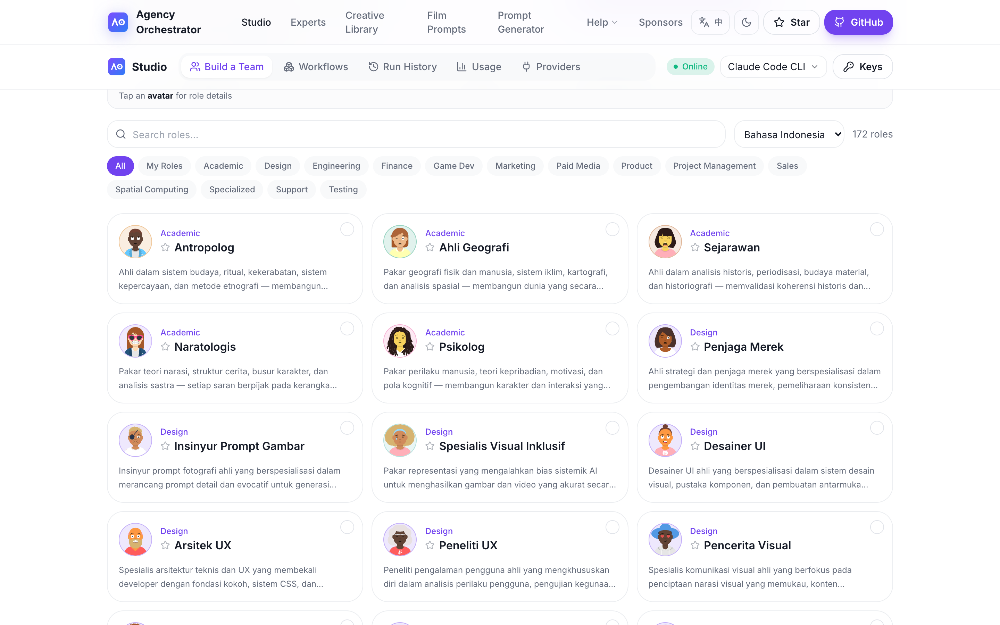

# agency-agents Bahasa Indonesia (Tim Pakar AI)

🌐 **Bahasa Indonesia** | [English (upstream)](https://github.com/msitarzewski/agency-agents) | [简体中文](https://github.com/jnMetaCode/agency-agents-zh) | [한국어](https://github.com/jnMetaCode/agency-agents-ko) | [Português (BR)](https://github.com/jnMetaCode/agency-agents-pt-BR) | [Русский](https://github.com/jnMetaCode/agency-agents-ru)

> **187 persona AI agent yang siap pakai** — mencakup engineering, design, marketing, product, game, security, finance, dan 18 divisi lainnya. Bukan template prompt generik: setiap agent punya persona, workflow profesional, dan deliverable yang jelas. Mendukung Claude Code / Cursor / Copilot dan 17 alat AI coding lainnya.

Versi komunitas Bahasa Indonesia dari [agency-agents](https://github.com/msitarzewski/agency-agents). Terjemahan lengkap 184 agent upstream. **PR dipersilakan** untuk agent khusus pasar Indonesia (Tokopedia, Shopee ID, GoTo / Gojek, WhatsApp Business, OVO, GoPay, dll.).

[](https://github.com/jnMetaCode/agency-agents-id)
[](https://opensource.org/licenses/MIT)
[](https://makeapullrequest.com)
[](https://www.npmjs.com/package/agency-agents-id)


### 📊 Skala Proyek

| 🤖 AI Agent | 🌏 Terjemahan upstream | 🇮🇩 Original Indonesia | 🧠 Alat | 🏢 Divisi |
|:---:|:---:|:---:|:---:|:---:|
| **187** | **184** | **3** | **17** | **18** |

---

## 🚀 Agency Orchestrator — Jalankan library persona ini secara nyata

> **💡 Satu kalimat, banyak pakar AI berkolaborasi otomatis, hasil lengkap dalam hitungan menit.**
>
> Library persona menyediakan pakarnya; [**Agency Orchestrator**](https://github.com/jnMetaCode/agency-orchestrator) membuat mereka bekerja seperti tim nyata.

```bash
npm install -g agency-orchestrator
ao compose "Buat analisis mendalam soal AI Agent" --run
```

```
🎭 Auto-casting → Narratologist + Psychologist + Content Creator + Narrative Designer
📊 Auto-orchestration → DAG workflow, deteksi dependency otomatis, eksekusi paralel
✅ Auto-delivery → hasil lengkap dalam beberapa menit
```

| Fitur | Penjelasan |
|:---|:---|
| 🎯 **Orchestration tanpa kode** | Bahasa alami atau YAML, deskripsikan kebutuhan dalam satu kalimat |
| ⚡ **Eksekusi DAG paralel** | Deteksi dependency otomatis, step yang independen jalan paralel, 2x lebih cepat |
| 🔄 **Resume dari checkpoint** | Step gagal bisa dijalankan ulang sendiri, tidak perlu mulai dari awal |
| 🆓 **6 LLM gratis** | Claude Code / Gemini CLI / Copilot / Codex / OpenClaw / Ollama |
| 💰 **3 integrasi API** | DeepSeek / Claude API / OpenAI |
| 📋 **32 template siap pakai** | Dev, marketing, data analytics, design, operations |

### Pakai library ini langsung di AO

Juga tersedia sebagai paket npm (`agency-agents-id`):

```bash
npm i agency-agents-id
```

Di workflow, set `agents_dir: "agency-agents-id"` — atau pilih **Bahasa Indonesia** dari dropdown library di halaman "Build a Team" pada Studio web:

<p align="center"></p>

<p align="center">
  <a href="https://github.com/jnMetaCode/agency-orchestrator">
    <strong>⭐ Lihat Agency Orchestrator — kerahkan 187 agent untuk Anda →</strong>
  </a>
</p>

---

## Apa ini?

Sebuah **library persona AI yang siap pakai**. Setiap agent punya identitas jelas, aturan kritis, workflow, dan deliverable terdefinisi. Pasang ke alat AI Anda, lalu aktifkan dengan bahasa alami.

**Beda dengan prompt biasa**: prompt biasa cuma bilang ke AI "kamu adalah ahli"; agent di sini mendefinisikan **cara berpikir, cara kerja, dan deliverable** dari ahli tersebut. Contoh: [Security Engineer](engineering/engineering-security-engineer.md) mereview kode poin per poin sesuai OWASP Top 10; [Frontend Developer](engineering/engineering-frontend-developer.md) merefactor komponen React berdasarkan ARIA / aksesibilitas / performance budget.

---

## Mulai cepat

### Cara 1: Install otomatis ke alat AI Anda

Mendukung **17 alat AI coding** populer:

```bash
./scripts/install.sh                       # Auto-detect & install
./scripts/install.sh --tool openclaw       # OpenClaw ⭐ rekomendasi
./scripts/install.sh --tool claude-code    # Claude Code
./scripts/install.sh --tool copilot        # GitHub Copilot
./scripts/install.sh --tool cursor         # Cursor
# ... dan 13 alat lainnya
```

> Claude Code dan GitHub Copilot bisa langsung; alat lain perlu `./scripts/convert.sh` lebih dulu.

### Cara 2: Salin manual

```bash
cp -r engineering/*.md ~/.claude/agents/
# Lalu di Claude Code: "Aktifkan mode Frontend Developer dan bantu saya buat komponen React"
```

### Cara 3: Sebagai referensi prompt

Lihat [CATALOG.md](CATALOG.md), salin/adaptasi sesuai kebutuhan.

---

## Roster agent

Katalog lengkap 187 agent: **[CATALOG.md](CATALOG.md)**. Ringkasan per divisi:

| Divisi | Agent | Peran khas |
|--------|-------|------------|
| 🛠️ Engineering | 29 | Frontend, Backend Architect, AI Engineer, DevOps, Security, SRE, Embedded, FPGA |
| 🎨 Design | 8 | UI/UX, Brand Guardian, Image Prompt Engineer, Visual Storyteller |
| 📢 Marketing | 30 | Growth Hacker, Content Creator, SEO, TikTok / Twitter / Instagram |
| 💰 Paid Media | 7 | Audit, Creative Strategist, PPC, Programmatic |
| 💼 Sales | 8 | Account Strategist, Sales Coach, MEDDPICC, Outbound |
| 🏦 Finance | 5 | Bookkeeper, FP&A, Investment Researcher, Fraud Detection |
| 📦 Product | 5 | PM, Feedback Synthesizer, Trend Researcher |
| 📋 Project Mgmt | 6 | Studio Producer, Experiment Tracker, Project Shipper |
| 🧪 Testing | 8 | Test Automation, API Tester, Performance Benchmarker |
| 🤝 Support | 6 | Incident Communicator, Customer Insights |
| 🔬 Specialized | 41 | Blockchain Security, SOC 2 / ISO 27001 / HIPAA, Legal Review, Real Estate |
| 🥽 Spatial Computing | 6 | XR User Research, AR/VR Engineer, Haptic Designer |
| 🎮 Game Dev | 20 | Unity, Unreal, Godot, Roblox, Blender |
| 📖 Academic | 5 | Antropolog, Psikolog, Sejarawan, Narratologis, Geograf |

---

## 🇮🇩 Agent khusus pasar Indonesia — PRs Welcome

Terjemahan 184 agent upstream sudah selesai. PR untuk agent berikut sangat dipersilakan:

- **Platform Indonesia**: WhatsApp Business / Cloud API, Instagram ID, TikTok ID, X (Twitter) ID
- **E-commerce / Marketplace**: Tokopedia seller, Shopee ID, Bukalapak, Blibli, Lazada ID
- **Super App**: Gojek / GoTo, Grab Indonesia, Traveloka
- **Fintech / Pembayaran**: OVO, GoPay, DANA, ShopeePay, integrasi QRIS, BI-FAST
- **Compliance**: UU PDP (Perlindungan Data Pribadi), OJK regulations, Kominfo
- **Vertikal**: Halal e-commerce, Edutech ID (Ruangguru/Zenius), Pertanian digital

Lihat [CONTRIBUTING.md](CONTRIBUTING.md).

---

## Skenario penggunaan

### Skenario 1: MVP untuk peluncuran global

**Tim Anda**:
1. **Frontend Developer** — membangun aplikasi React
2. **Backend Architect** — merancang API dan database
3. **Growth Hacker** — strategi akuisisi user
4. **Rapid Prototyper** — iterasi cepat
5. **Reality Checker** — quality gate sebelum rilis

### Skenario 2: Audit security + compliance

**Tim Anda**:
1. **Security Engineer** — review kode pakai OWASP Top 10
2. **Blockchain Security Auditor** (jika relevan) — analisis kerentanan smart contract
3. **Compliance Auditor** — cek SOC 2 / ISO 27001 / HIPAA
4. **Incident Communicator** — komunikasikan risiko ke manajemen
5. **Technical Writer** — dokumentasikan laporan audit

---

## Kontribusi

Terjemahan, perbaikan konten, agent baru khusus Indonesia — semua welcome. Detail di [CONTRIBUTING.md](CONTRIBUTING.md).

---

## Proyek terkait

| Proyek | Posisi | Ringkasan |
|--------|--------|-----------|
| **Proyek ini** (agency-agents-id) | 🎭 Library persona berbahasa Indonesia | 187 pakar AI **siap pakai**, PR untuk pasar Indonesia welcome |
| [agency-agents-zh](https://github.com/jnMetaCode/agency-agents-zh)  | 🇨🇳 Versi China | 215 agent (165 terjemahan + 50 original pasar China) |
| [agency-agents-ko](https://github.com/jnMetaCode/agency-agents-ko) | 🇰🇷 Versi Korea | 187 agent terjemahan |
| [agency-agents-pt-BR](https://github.com/jnMetaCode/agency-agents-pt-BR) | 🇧🇷 Versi Brasil | 187 agent terjemahan |
| [agency-agents-ru](https://github.com/jnMetaCode/agency-agents-ru) | 🇷🇺 Versi Rusia | 187 agent terjemahan |
| [agency-agents](https://github.com/msitarzewski/agency-agents) | 🌏 Upstream Inggris | 184 agent original |
| [agency-orchestrator](https://github.com/jnMetaCode/agency-orchestrator) | 🚀 Engine orchestration | Satu kalimat → 187 pakar berkolaborasi, **hasil dalam menit** |

---

## Ucapan terima kasih

- Versi asli (Inggris): [msitarzewski/agency-agents](https://github.com/msitarzewski/agency-agents) (MIT)
- Terima kasih kepada [@msitarzewski](https://github.com/msitarzewski) atas proyek luar biasa ini
- Terjemahan Bahasa Indonesia dikerjakan secara batch dengan Claude Sonnet, dengan review sampel representatif. PR untuk perbaikan gaya bahasa selalu welcome.

---

## Lisensi

MIT License — bebas digunakan untuk komersial atau pribadi.

---

<div align="center">

**187 persona AI agent, 17 alat didukung, plug-and-play**

[⭐ Star proyek](https://github.com/jnMetaCode/agency-agents-id) · [Buat Issue](https://github.com/jnMetaCode/agency-agents-id/issues) · [Kontribusi](https://github.com/jnMetaCode/agency-agents-id/pulls)

Berdasarkan [agency-agents](https://github.com/msitarzewski/agency-agents), diterjemahkan dan dilokalkan untuk Indonesia

</div>
